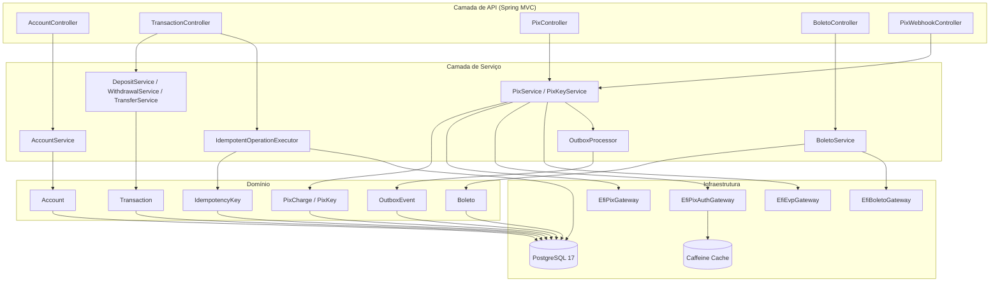
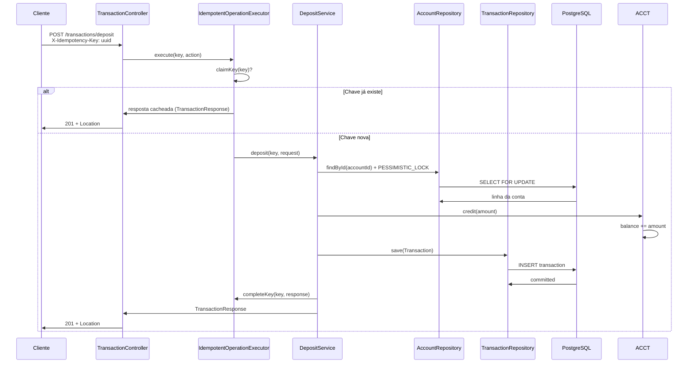
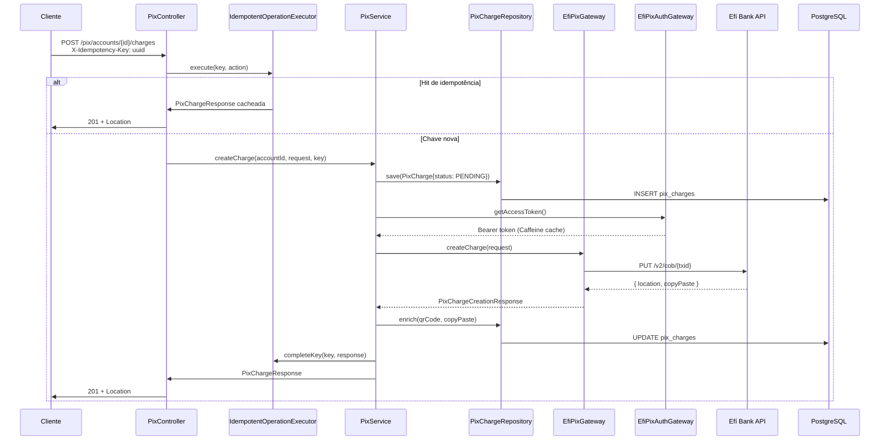
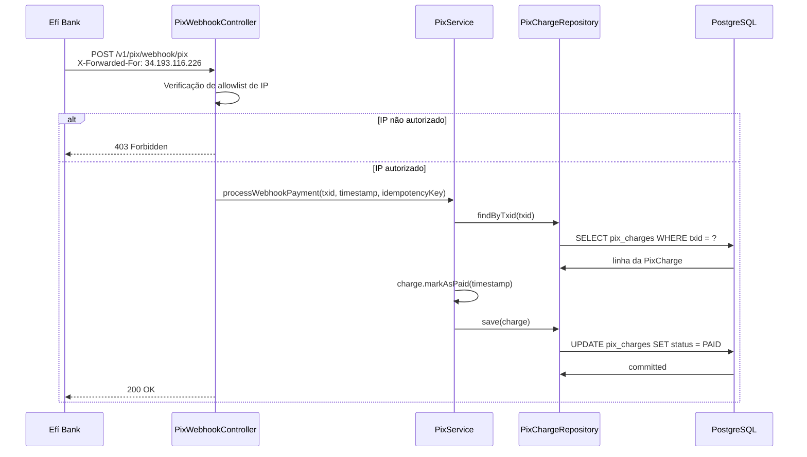
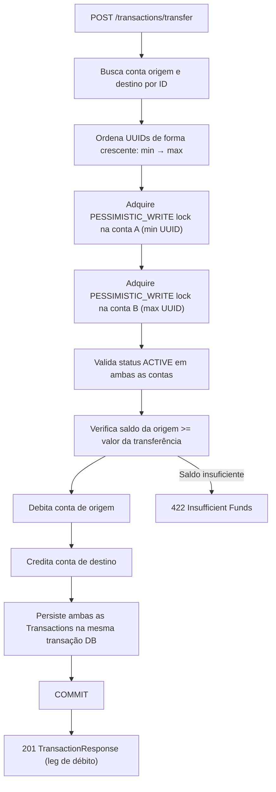
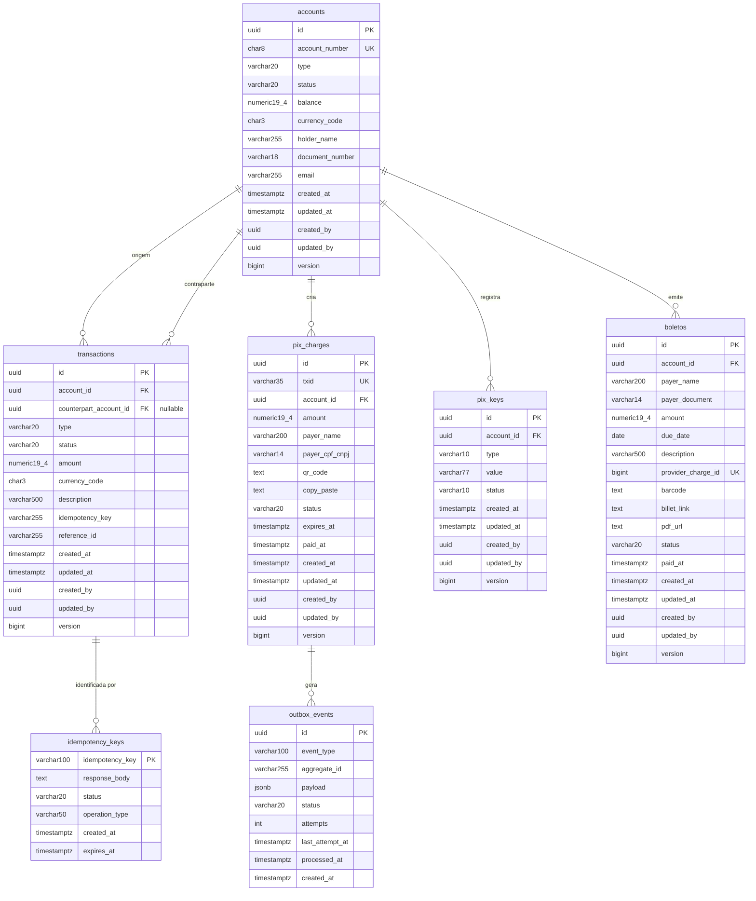

# banking-mvp

> ⚠️ **Status: Em desenvolvimento ativo.** O contrato de API pode mudar, funcionalidades podem estar incompletas ou stubadas, e o uso em produção não é recomendado neste estágio.

MVP de uma plataforma bancária brasileira construída com **Spring Boot**, integrando **pagamentos PIX instantâneos** e **boletos bancários** via API da **Efí Bank**. O projeto serve como referência de arquitetura para sistemas financeiros que demandam consistência transacional, idempotência e integração com infraestrutura de pagamentos do Banco Central.

---

## Índice

- [Visão Geral da Arquitetura](#visão-geral-da-arquitetura)
- [Decisões de Design e Trade-offs](#decisões-de-design-e-trade-offs)
- [Fluxos Principais](#fluxos-principais)
  - [Depósito](#fluxo-de-depósito)
  - [Criação de Cobrança PIX](#fluxo-de-criação-de-cobrança-pix)
  - [Webhook PIX](#fluxo-de-webhook-pix)
  - [Transferência entre Contas](#fluxo-de-transferência-prevenção-de-deadlock)
- [Modelo de Dados](#modelo-de-dados-er)
- [Começando](#começando)
- [Variáveis de Ambiente](#variáveis-de-ambiente)
- [Referência da API](#referência-da-api)
- [Architecture Decision Records](#architecture-decision-records)
- [Notas de Performance](#notas-de-performance)
- [Roadmap e Limitações Conhecidas](#roadmap--limitações-conhecidas)

---

## Visão Geral da Arquitetura

O sistema é organizado em camadas clássicas — **API → Service → Domain → Infrastructure** — com separação clara de responsabilidades entre orquestração, lógica de negócio e integração com sistemas externos.



### Stack Técnica

| Camada | Tecnologia | Justificativa |
|---|---|---|
| Runtime | Java 21 | Virtual threads disponíveis; LTS com suporte estendido |
| Framework Web | Spring Boot + Spring MVC | Ecossistema maduro; integração nativa com JPA, Resilience4j e Actuator |
| HTTP Client externo | WebClient (Spring WebFlux) | Gerenciamento de conexão superior ao `RestTemplate`; API de timeout reativa |
| Persistência | Spring Data JPA + Hibernate | Produtividade para CRUDs; mapeamento ORM para aggregates |
| Migrations de schema | Flyway | Versionamento determinístico do schema; rastreabilidade em ambientes multi-instância |
| Banco de dados | PostgreSQL 17 | Garantias ACID críticas para dados financeiros; suporte nativo a JSONB para payloads de eventos |
| Cache | Caffeine | Cache in-process de baixa latência para tokens OAuth; sem overhead operacional de Redis |
| Resiliência | Resilience4j (Retry + Circuit Breaker) | Retry com backoff exponencial para chamadas ao PSP; circuit breaker configurado (pendente de ativação) |
| Observabilidade | Spring Boot Actuator + Prometheus | Health checks e métricas expostas nativamente |
| Documentação da API | Springdoc (OpenAPI 3) | Swagger UI gerado a partir das anotações do código |

---

## Decisões de Design e Trade-offs

Cada decisão arquitetural em sistemas financeiros carrega consequências diretas de consistência, throughput e operabilidade. A tabela abaixo consolida as principais escolhas e seus trade-offs explícitos.

| Decisão | Motivação | Desvantagens |
|---|---|---|
| **PostgreSQL 17** | Garantias ACID para dados financeiros; JSONB para payloads de eventos; Flyway para migrations versionadas | Overhead operacional comparado a bancos gerenciados; exige tuning explícito do pool de conexões |
| **Spring MVC + WebClient** | MVC para APIs REST síncronas; WebClient para chamadas HTTP não-bloqueantes a PSPs externos | Modelo de programação misto aumenta carga cognitiva; `WebClient` exige disciplina rigorosa no uso de `.block()` |
| **Caffeine (cache local)** | Cache de token sem overhead de Redis; latência sub-milissegundo | Não compartilhado entre instâncias — tokens OAuth podem ser buscados redundantemente em deploys multi-instância |
| **Transactional Outbox** | Entrega garantida de eventos sem transações distribuídas ou 2PC | Latência adicional de ~5s por polling; janela de consistência eventual; requer job de cleanup para linhas antigas |
| **Idempotência via banco** | Retries seguros para todas as operações mutantes; janela de 24h com expiração indexada | Write adicional por request; volume de storage cresce se o job de limpeza atrasar |
| **Optimistic locking nas entidades** | Campo `@Version` em todos os aggregate roots; barato em leituras com baixa contenção | Retry storms sob alta contenção; inadequado para débitos concorrentes de alta frequência sem escalonamento para pessimistic locking |
| **Pessimistic locking para transferências** | `SELECT FOR UPDATE` em ordem crescente de UUID elimina deadlocks em transferências entre os mesmos pares de contas | Maior tempo de lock hold; pode serializar throughput em contas com alto volume de transferências concorrentes |
| **JPA/Flyway híbrido** | Flyway para tabelas core (accounts, transactions, outbox); `ddl-auto=update` para a tabela de boletos | Risco de inconsistência — mudanças no schema de boletos não são rastreadas em migrations versionadas |
| **Resilience4j Retry (Efí Bank)** | Backoff exponencial em falhas transitórias; métricas por operação | Retries amplificam carga em um PSP já sobrecarregado; `max-attempts` é fixo e não adaptativo |
| **Circuit Breaker (desabilitado)** | Configurado para prevenir falhas em cascata | Comentado — requer tuning de thresholds antes de ativação em produção |
| **Expiração de PIX/Boletos via scheduler** | Jobs cron para charges e boletos vencidos | Execuções perdidas em reinicializações da JVM; sem distributed locking entre instâncias |
| **Sem message broker** | Outbox pattern substitui Kafka/RabbitMQ; menor complexidade operacional | Throughput limitado pelo polling single-threaded do outbox (intervalo de 5s) |

---

## Fluxos Principais

### Fluxo de Depósito

O depósito é idempotente por design. O `IdempotentOperationExecutor` atua como gatekeeper: se a chave de idempotência já existe e está processada, retorna a resposta cacheada sem tocar no banco financeiro. Somente em caso de chave nova o saldo é creditado sob lock pessimista.



---

### Fluxo de Criação de Cobrança PIX

A cobrança PIX é persistida localmente como `PENDING` antes da chamada ao PSP. Isso garante rastreabilidade mesmo em caso de timeout na chamada à Efí Bank — o registro existe no banco e pode ser reconsolidado posteriormente.



---

### Fluxo de Webhook PIX

O endpoint de webhook é protegido por allowlist de IP (Efí Bank: `34.193.116.226`) e não requer autenticação JWT, seguindo a especificação do BACEN para recebimento de notificações PIX.

> ⚠️ **Limitação conhecida:** O status da cobrança é atualizado para `PAID`, mas o crédito correspondente no saldo da conta ainda **não está implementado**. O fluxo end-to-end completo (cobrança → webhook → crédito em conta) está pendente.



---

### Fluxo de Transferência (Prevenção de Deadlock)

Transferências entre contas são o caso mais sensível de contenção. O `TransferService` adquire locks pessimistas em **ordem crescente de UUID** — uma técnica clássica de ordenação de recursos que elimina a possibilidade de espera circular entre threads concorrentes tentando travar os mesmos pares de contas em ordens opostas.



---

## Modelo de Dados (ER)

O modelo reflete a separação entre entidades de negócio (contas e transações), instrumentos de pagamento (PIX, boletos) e infraestrutura transversal (idempotência, outbox).



---

## Começando

### Pré-requisitos

- **Java 21**
- **Maven 3.9+** (wrapper incluso: `./mvnw` / `mvnw.cmd`)
- **PostgreSQL 17** (via Docker Compose ou standalone)
- **Credenciais sandbox da Efí Bank** — client ID, client secret e certificado PKCS#12

### Setup Local

**1. Clonar e configurar variáveis de ambiente**

```bash
cp .env .env.local
# Edite .env.local e preencha:
#   - Credenciais POSTGRES_*
#   - EFI_CLIENT_ID / EFI_CLIENT_SECRET
#   - EFI_CERT_PATH / EFI_CERT_PASSWORD
#   - EFI_WEBHOOK_URL (use ngrok ou similar para dev local)
```

**2. Subir PostgreSQL via Docker Compose**

```bash
docker compose up -d postgres
```

**3. Build e execução**

```bash
./mvnw spring-boot:run -Dspring-boot.run.profiles=dev
```

A aplicação sobe na porta **8085**.

**4. Executar testes**

```bash
# Testes de integração (requer Docker para Testcontainers)
./mvnw test -Dspring.profiles.active=integration-test

# Testes E2E contra o sandbox da Efí Bank (requer credenciais reais)
./mvnw test -Dspring.profiles.active=e2e-test
```

### Portas e Endpoints de Infraestrutura

| Serviço | Porta / URL |
|---|---|
| Aplicação | `8085` |
| PostgreSQL | `5434` |
| Swagger UI | `http://localhost:8085/swagger-ui.html` |
| Actuator Health | `http://localhost:8085/actuator/health` |
| Prometheus Metrics | `http://localhost:8085/actuator/prometheus` |

---

## Variáveis de Ambiente

| Variável | Obrigatória | Exemplo | Finalidade |
|---|---|---|---|
| `POSTGRES_DB` | ✅ | `banking-mvp-db` | Nome do banco de dados |
| `POSTGRES_USER` | ✅ | `banking-mvp` | Usuário do banco |
| `POSTGRES_PASSWORD` | ✅ | `vQ9!Lr7&T2@KxPZ4M` | Senha do banco |
| `EFI_CLIENT_ID` | ✅ | `Client_Id_...` | Client ID OAuth da Efí Bank |
| `EFI_CLIENT_SECRET` | ✅ | `Client_Secret_...` | Client Secret OAuth da Efí Bank |
| `EFI_CERT_PATH` | ✅ | `file:./certs/cert.p12` | Caminho do certificado PKCS#12 |
| `EFI_CERT_PASSWORD` | ❌ | `certpass` | Senha do certificado (vazio se não houver) |
| `EFI_WEBHOOK_URL` | ✅ | `https://xxx.ngrok-free.dev/v1/pix/webhook?ignorar=` | URL pública para callbacks PIX |
| `EFI_PIX_KEY` | ❌ | `5dd78dfe-b966-...` | Chave PIX padrão para criação de cobranças |
| `EFI_BOLETO_NOTIFICATION_URL` | ❌ | `https://xxx.ngrok-free.dev/v1/boleto/webhook` | URL de webhook para notificações de boleto |
| `JWT_PRIVATE_KEY_PATH` | ❌ | `./keys/private.pem` | Caminho da chave privada RS256 |
| `JWT_PUBLIC_KEY_PATH` | ❌ | `./keys/public.pem` | Caminho da chave pública RS256 |

---

## Referência da API

Todos os endpoints requerem `Authorization: Bearer <jwt>`, exceto onde indicado.

### Contas

| Método | Path | Descrição |
|---|---|---|
| `POST` | `/accounts` | Abrir nova conta |
| `GET` | `/accounts/{accountId}` | Consultar detalhes da conta |
| `POST` | `/accounts/{accountId}/block` | Bloquear conta (`ACTIVE → BLOCKED`) |
| `POST` | `/accounts/{accountId}/unblock` | Desbloquear conta (`BLOCKED → ACTIVE`) |
| `POST` | `/accounts/{accountId}/close` | Encerrar conta (`ACTIVE/BLOCKED → CLOSED`, exige saldo zero) |

<details>
<summary><strong>POST /accounts — Exemplo de request/response</strong></summary>

**Request:**
```json
{
  "holderName": "Jane Doe",
  "email": "jane@example.com",
  "documentNumber": "12345678901",
  "type": "CHECKING"
}
```

**Response `201 Created`:**
```json
{
  "accountId": "9b1deb4d-3b7d-4bad-9bdd-2b0d7b3dcb6d",
  "accountNumber": "0001-2345",
  "type": "CHECKING",
  "holderName": "Jane Doe",
  "email": "jane@example.com",
  "status": "ACTIVE",
  "balance": 0.00,
  "currency": "BRL",
  "createdAt": "2024-06-15T09:00:00Z"
}
```
</details>

---

### Transações

Todos os endpoints de transação exigem o header `X-Idempotency-Key: <uuid>`.

| Método | Path | Descrição | Idempotente |
|---|---|---|---|
| `POST` | `/transactions/deposit` | Creditar fundos na conta | ✅ |
| `POST` | `/transactions/withdrawal` | Debitar fundos da conta | ✅ |
| `POST` | `/transactions/transfer` | Mover fundos entre contas | ✅ |

<details>
<summary><strong>POST /transactions/transfer — Exemplo de request/response</strong></summary>

**Request:**
```json
{
  "originAccountId": "9b1deb4d-3b7d-4bad-9bdd-2b0d7b3dcb6d",
  "destinationAccountId": "1a2b3c4d-5e6f-7a8b-9c0d-1e2f3a4b5c6d",
  "amount": 300.00,
  "currency": "BRL",
  "description": "Pagamento da fatura #123"
}
```

**Response `201 Created`:**
```json
{
  "transactionId": "a1b2c3d4-e5f6-7890-abcd-ef1234567890",
  "accountId": "9b1deb4d-3b7d-4bad-9bdd-2b0d7b3dcb6d",
  "counterpartAccountId": "1a2b3c4d-5e6f-7a8b-9c0d-1e2f3a4b5c6d",
  "type": "TRANSFER_DEBIT",
  "amount": 300.00,
  "currency": "BRL",
  "balanceAfter": 700.00,
  "status": "COMPLETED",
  "createdAt": "2024-06-15T12:00:00Z"
}
```
</details>

---

### PIX

| Método | Path | Descrição | Idempotente |
|---|---|---|---|
| `POST` | `/pix/accounts/{accountId}/charges` | Criar cobrança PIX (QR Code) | ✅ |
| `GET` | `/pix/accounts/{accountId}/charges/{txid}` | Consultar cobrança PIX | — |
| `DELETE` | `/pix/accounts/{accountId}/charges/{txid}` | Cancelar cobrança pendente | — |
| `POST` | `/pix/accounts/{accountId}/keys` | Registrar chave PIX | — |
| `GET` | `/pix/accounts/{accountId}/keys` | Listar chaves PIX | — |
| `DELETE` | `/pix/accounts/{accountId}/keys/{keyId}` | Remover chave PIX | — |
| `POST` | `/v1/pix/webhook` | Probe de registro de webhook (sem auth) | — |
| `POST` | `/v1/pix/webhook/pix` | Webhook de pagamento PIX (sem auth, IP-restrito) | — |

<details>
<summary><strong>POST /pix/accounts/{accountId}/charges — Exemplo de request/response</strong></summary>

**Request:**
```json
{
  "amount": 150.00,
  "payerName": "John Doe",
  "payerCpfCnpj": "12345678901"
}
```

**Response `201 Created`:**
```json
{
  "txid": "A1B2C3D4E5F6G7H8I9J0K1L2M3",
  "accountId": "9b1deb4d-3b7d-4bad-9bdd-2b0d7b3dcb6d",
  "amount": 150.00,
  "status": "PENDING",
  "copyPaste": "00020101021226870014br.gov.bcb.pix...",
  "expiresAt": "2024-06-15T11:30:00Z",
  "createdAt": "2024-06-15T11:00:00Z"
}
```
</details>

---

### Boletos

| Método | Path | Descrição | Idempotente |
|---|---|---|---|
| `POST` | `/boletos` | Emitir novo boleto | ✅ |
| `GET` | `/boletos/{boletoId}` | Consultar boleto | — |

<details>
<summary><strong>POST /boletos — Exemplo de request/response</strong></summary>

**Request:**
```json
{
  "accountId": "9b1deb4d-3b7d-4bad-9bdd-2b0d7b3dcb6d",
  "payerName": "John Doe",
  "payerDocument": "12345678901",
  "amount": 500.00,
  "dueDate": "2024-12-31",
  "description": "Fatura #12345"
}
```

**Response `201 Created`:**
```json
{
  "id": "3fa85f64-5717-4562-b3fc-2c963f66afa6",
  "providerChargeId": 12345678,
  "payerName": "John Doe",
  "payerDocument": "12345678901",
  "amount": 500.00,
  "dueDate": "2024-12-31",
  "description": "Fatura #12345",
  "barcode": "00000.00000 00000.000000 00000.000000 0 00000000000000",
  "billetLink": "https://boleto.example.com/12345678",
  "pdfUrl": "https://boleto.example.com/pdf/12345678",
  "status": "PENDING"
}
```
</details>

---

## Architecture Decision Records

### ADR-001 — Transactional Outbox no lugar de publicação direta de eventos

**Contexto:** Operações financeiras (depósitos, transferências, cobranças PIX) não podem perder eventos. Uma publicação direta para um message broker após o commit da transação DB cria uma janela de falha: o banco comita, a publicação falha, o evento se perde permanentemente.

**Decisão:** Eventos são escritos na tabela `outbox_events` dentro da mesma transação DB da operação de negócio. Um `OutboxProcessor` dedicado faz polling de eventos pendentes e os despacha, marcando cada um como processado.

**Consequências:**

| | |
|---|---|
| ✅ | Entrega at-least-once garantida — o evento sobrevive a crashes da JVM |
| ✅ | Sem transação distribuída ou 2PC |
| ✅ | Log de auditoria na mesma transação — consistente por construção |
| ❌ | Latência adicional: eventos publicados assincronamente com janela de até `interval-ms` (padrão 5s) |
| ❌ | Eventos duplicados são possíveis (at-least-once, não exactly-once) — consumidores devem ser idempotentes |
| ❌ | Requer job de cleanup para chaves de idempotência expiradas e linhas antigas do outbox |

---

### ADR-002 — Idempotência baseada em banco no lugar de middleware

**Contexto:** Clientes reenviam requests em caso de timeout de rede. Sem idempotência, um retry pode creditar um saldo duas vezes.

**Decisão:** Toda operação mutante requer o header `X-Idempotency-Key`. A chave, o tipo de operação e a resposta serializada são armazenados em `idempotency_keys` com TTL de 24h. Requests concorrentes para a mesma chave usam um padrão claim-winner/await para evitar processamento duplicado.

**Consequências:**

| | |
|---|---|
| ✅ | Efeito exactly-once para operações idempotentes dentro da janela de TTL |
| ✅ | Cobre os cenários crash-after-commit e crash-before-reply |
| ✅ | Resposta armazenada permite retornar o resultado original em replays |
| ❌ | Write adicional por request mutante |
| ❌ | Requests "perdedores" na corrida precisam aguardar — risco de `IdempotencyTimeoutException` |
| ❌ | Janela de 24h é um equilíbrio entre crescimento de storage e practicidade de retries; retries legítimos de longa data serão tratados como novas operações |

---

### ADR-003 — Pessimistic locking para transferências, optimistic para demais operações

**Contexto:** Transferências concorrentes entre o mesmo par de contas em direções opostas podem causar deadlocks se os locks forem adquiridos em ordem inconsistente entre as threads.

**Decisão:** `TransferService` adquire locks `PESSIMISTIC_WRITE` nas duas contas ordenadas por UUID crescente antes de qualquer validação ou mutação. Demais operações (depósitos, saques) usam optimistic locking via `@Version`.

**Consequências:**

| | |
|---|---|
| ✅ | Sem deadlocks: ordenação determinística de locks elimina ciclos de espera circular |
| ✅ | Lock pessimista garante que o saldo não mudou entre a leitura e a escrita |
| ❌ | Maior tempo de lock hold em transferências vs. abordagens otimistas |
| ❌ | Throughput pode serializar em contas com alto volume de transferências concorrentes |
| ❌ | Depósitos/saques com optimistic locking lançam `OptimisticLockingFailureException` sob contenção — com retry de até 3 tentativas |

---

### ADR-004 — WebClient para chamadas ao PSP externo (em modo bloqueante)

**Contexto:** A aplicação é síncrona (Spring MVC), mas as chamadas ao PSP da Efí Bank são I/O-bound e se beneficiam de um cliente HTTP moderno.

**Decisão:** Uso de `WebClient` (do Spring WebFlux) em lugar de `RestTemplate`. As chamadas são explicitamente `.block()`adas porque a camada chamadora é MVC síncrono.

**Consequências:**

| | |
|---|---|
| ✅ | Melhor gerenciamento de conexão e API de timeout reativa (`Duration.ofSeconds(10)`) |
| ✅ | Preparado para migração futura a uma arquitetura reativa completa |
| ❌ | O `.block()` explícito anula o benefício não-bloqueante no call site — isso é uma ponte, não uma arquitetura reativa |
| ❌ | `.block()` em escala pode causar thread starvation em pools pequenos |

---

### ADR-005 — Caffeine no lugar de Redis para cache de tokens OAuth

**Contexto:** Tokens OAuth da Efí Bank expiram após ~3600s e são obtidos via client credentials flow (id + secret + certificado mTLS).

**Decisão:** Cache do access token em Caffeine com TTL ligeiramente inferior à expiração real do token.

**Consequências:**

| | |
|---|---|
| ✅ | Zero overhead operacional comparado ao Redis |
| ✅ | Recuperação do token em latência sub-milissegundo |
| ❌ | Tokens não são compartilhados entre instâncias — cada instância busca o próprio |
| ❌ | Token expirado em cache pode causar cascata de 401s até o mecanismo de eviction do cache agir |
| ❌ | Sem auto-refresh proativo — a renovação é reativa (cache miss ou eviction por 401) |

---

## Notas de Performance

### Estratégia de Cache

| Cache | Chave | TTL | Trigger de Eviction |
|---|---|---|---|
| `efi-oauth-token` | `"access_token"` | 3000s (hardcoded) | Eviction manual em resposta 401 do PSP |
| `cnpj` | valor do CNPJ | 3000s | Eviction manual |

> **Atenção:** O TTL do Caffeine (3000s) é fixo e pode não coincidir com a expiração real do token da Efí Bank. Tokens cacheados além da expiração real causarão 401s até o entry expirar naturalmente.

### Índices Críticos do Banco de Dados

Esses índices cobrem os hot paths da aplicação e devem ser monitorados para bloat e utilização:

| Índice | Coluna(s) | Tipo | Finalidade |
|---|---|---|---|
| `idx_transactions_account_created` | `(account_id, created_at DESC)` | B-tree | Histórico de transações e verificações de consistência de saldo |
| `idx_transactions_idempotency` | `(idempotency_key, type)` | Unique | Previne transações duplicadas em retries concorrentes |
| `idx_pix_charges_expiration` | `(expires_at) WHERE status = 'PENDING'` | Partial | Job de expiração de PIX escaneia apenas linhas pendentes |
| `idx_pix_keys_active_value` | `(value) WHERE status = 'ACTIVE'` | Unique Partial | Impõe regra BACEN de unicidade de chave ativa |
| `idx_outbox_status_created` | `(status, created_at) WHERE status = 'PENDING'` | Partial | Outbox processor busca apenas linhas que precisam de processamento |

### Pool de Conexões

HikariCP configurado com `maximum-pool-size=10` e `minimum-idle=2`. Adequado para ambiente de desenvolvimento single-instance, mas provavelmente subdimensionado para um deploy multi-instância em produção recebendo webhooks PIX/boleto concorrentes.

### Pontos de Contenção Conhecidos (Slow Paths)

**Polling do outbox single-threaded:** O `OutboxProcessor` roda em uma única thread da JVM com intervalo de 5s. Sob alto volume de eventos, o processamento vai atrasar progressivamente.

**Token OAuth por instância:** Cada instância gerencia seu próprio token em cache local. Aceitável em sandbox; ineficiente em produção multi-instância.

**Schedulers sem distributed locking:** `PixExpirationJob` e `BoletoExpirationScheduler` executam em todas as instâncias no mesmo cron. Sem um mecanismo de distributed lock (ex: ShedLock), todas as instâncias tentarão expirar os mesmos registros simultaneamente.

**Processamento de webhook PIX item a item:** Se a Efí Bank entregar um batch com muitos eventos, cada um é processado em transação separada. Não há otimização de batch.

**Carga de boletos vencidos em memória:** `findAllPendingOverdue` carrega todos os boletos vencidos de uma vez antes de atualizá-los. Aceitável para volumes baixos; não escala para milhares de registros.

---

## Roadmap / Limitações Conhecidas

### Funcionalidades Incompletas ou Não Implementadas

| Item | Descrição |
|---|---|
| **JWT Auth (filter chain)** | As anotações `@SecurityRequirement(name = "bearerAuth")` estão presentes em todos os controllers, mas o filtro de segurança JWT **não está conectado**. Todos os endpoints estão atualmente abertos. |
| **Migration de boletos** | A tabela `boletos` é gerenciada pelo `ddl-auto=update` do JPA em vez de uma migration Flyway. Mudanças de schema no entity de boleto não são rastreadas por versão. |
| **Webhook handler de boletos** | `POST /v1/boleto/webhook` para receber notificações de pagamento de boleto da Efí Bank está referenciado na configuração, mas nenhum handler de controller correspondente foi encontrado. |
| **Circuit breaker** | O Resilience4j circuit breaker está totalmente configurado em `application-dev.properties`, mas comentado. Requer tuning de thresholds antes da ativação. |
| **Crédito em conta após pagamento PIX** | Quando um webhook PIX é recebido, o status da cobrança é atualizado para `PAID`, mas o **saldo da conta não é creditado**. O fluxo end-to-end completo (cobrança → webhook → crédito) está pendente. |
| **OutboxEventDispatcher** | O `OutboxProcessor` despacha eventos por tipo, mas nenhuma implementação concreta de `OutboxEventDispatcher` foi encontrada. Eventos serão marcados como `FAILED` no passo de lookup do dispatcher. |
| **Histórico de transações da conta** | `GET /accounts/{accountId}/transactions` é referenciado na documentação do controller, mas o handler do endpoint não foi confirmado. |
| **Padronização de fault codes de boleto** | `BoletoFaultCode.java` contém um TODO: fault codes de boleto usam prefixos mistos (`BANKING_BOLETO_00X`) inconsistentes com o restante da base de código. |
